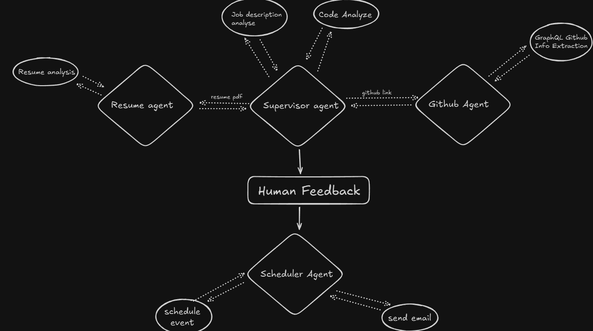

# HireBuddy - AI-Powered Hiring Assistant

<div align="center">
  
[](https://www.youtube.com/watch?v=ABo2hvASLmk)
[](https://python.org)
[](https://portialabs.ai)

*Your smart hiring assistant*

</div>

## Live Demo (Click to Watch)

[](https://www.youtube.com/watch?v=ABo2hvASLmk "HireBuddy End-to-End Demo")


## What is HireBuddy?

HireBuddy takes a resume and a job description to quickly analyze a candidate's experience, projects, and GitHub profile, including repositories, activity, and languages. It then produces a transparent score with a clear breakdown of the factors. If a human reviewer approves the analysis, the system automatically prepares the interview email and scheduling details in one seamless flow.

**Problem**
Early screening today is slow and inconsistent:
- Re-reading similar resumes
- Skipping or shallow GitHub checks
- Little written reasoning
- Manual email + scheduling steps

Hiring teams need fast, consistent, explainable evaluation without adding another bloated platform.

**Solution**
Multi‑agent flow (Resume, GitHub, Matching, Scheduler) powered by Portia AI:
- Builds a structured candidate profile
- Analyzes repos, activity, languages
- Produces a weighted score with plain reasons
- Streams each step so you see progress
- Can draft emails and prep an interview slot

**How It Solves It**
Everything runs as one simple flow: ingest → enrich → score → decide → (optional) schedule. Standard scoring plus saved reasoning reduces bias and keeps a record while leaving the final call to the recruiter.

## System Architecture



### Architecture Walkthrough Video (Click to Watch)

[](https://www.youtube.com/watch?v=gjOww3AcLLw "Architecture Deep Dive")

Short video explaining agent orchestration, data flow, and scoring pipeline.

HireBuddy uses a multi-agent architecture where specialized AI agents collaborate:

- **Resume Agent** - Extracts structured data from any resume format using LLM parsing
- **GitHub Agent** - Performs deep analysis of coding profiles, repositories, and contribution patterns  
- **Supervisor Agent** - Orchestrates the workflow and makes intelligent routing decisions
- **Scheduler Agent** - Handles interview scheduling with Google Calendar and email automation

Each agent specializes in their domain while the supervisor coordinates the entire evaluation process.

## Core Features

### Intelligent Resume Analysis
- PDF / DOCX / text parsing
- Structured skills, experience, education
- Normalized skill grouping

### Advanced GitHub Analysis  
- Repo relevance + activity
- Language / stack map
- Contribution & quality hints

### Smart Matching
- Weighted scoring (skills, experience, GitHub, education)
- Clear reasoning lines

### Automated Workflow
- Live step stream
- Optional email + scheduling
- Decision log (CSV/JSON)

## Why We Use Portia AI
Portia AI is the backbone. All agents (planner, resume, GitHub, scheduler) run on it. It orders steps, shares data, calls tools, streams status, and retries on soft failures (like rate limits). Less glue code, easier to add new agents (coding test, ATS export). Tools used: resume_parser, github_scanner, job_matcher, assessment_generator, candidate_tracker, repository/code analyzers, scheduler (calendar + email). Shared context removes manual hand‑offs and keeps an audit trail.

## How It Works
1. Upload resume + job description
2. Parse resume → structured profile
3. Scan GitHub → repos, activity, languages
4. Score + show reasons
5. (Optional) Generate email + scheduling data
6. Save decision

## Quick Start

### Prerequisites
- Python 3.13+
- Git
- Google account (for calendar integration)
- GitHub account (for repository analysis)

### Installation

1. **Clone and Setup**
   ```bash
   git clone https://github.com/yourusername/HireBuddy.git
   cd HireBuddy
   
   # Install UV package manager (recommended)
   powershell -ExecutionPolicy ByPass -c "irm https://astral.sh/uv/install.ps1 | iex"
   
   # Install dependencies
   uv sync
   
   # Activate virtual environment
   .venv\Scripts\activate  # Windows
   # source .venv/bin/activate  # macOS/Linux
   ```

2. **Configure Environment**
   ```bash
   cp env.example .env
   ```
   
   Edit `.env` with your API keys:
   ```env
   # Required: Google AI API Key (get from https://aistudio.google.com/)
   GOOGLE_API_KEY=your_google_api_key_here
   
   # Required: GitHub Token (get from https://github.com/settings/tokens)
   GITHUB_TOKEN=your_github_personal_access_token
   
   # Required: Portia API Key (get from https://app.portialabs.ai/)
   PORTIA_API_KEY=your_portia_api_key_here
   ```

3. **Run the Application**
   ```bash
   python app.py
   ```
   
   Open `http://localhost:5000` in your browser.

### API Key Setup

**Google AI API Key**
- Visit [Google AI Studio](https://aistudio.google.com/)
- Create/select project and generate API key
- Note: Free tier has 200 requests/day limit

**GitHub Personal Access Token**  
- Go to [GitHub Settings > Tokens](https://github.com/settings/tokens)
- Generate token with `public_repo`, `read:user`, `user:email` scopes

**Portia API Key**
- Visit [Portia Labs](https://app.portialabs.ai/)
- Create account and generate API key for email/calendar features

## Project Structure

```
HireBuddy/
├── app.py                      # Flask web application
├── main.py                     # CLI entry point
├── agents/                     # AI agent implementations
│   ├── planner_agent.py        # Main workflow orchestrator
│   ├── github_agent.py         # GitHub analysis specialist
│   ├── resume_agent.py         # Resume parsing agent
│   └── scheduler_agent.py      # Interview scheduling agent
├── tools/                      # Core analysis tools
│   ├── github_scanner.py       # GitHub API integration
│   ├── resume_parser.py        # Multi-format resume parsing
│   ├── job_matcher.py          # Candidate-job alignment
│   ├── assessment_generator.py # Comprehensive evaluation engine
│   └── candidate_tracker.py    # Decision tracking and analytics
├── utils/                      # Data models and utilities
│   └── schemas.py              # Pydantic data models
├── templates/                  # Web interface
│   └── index.html              # Modern responsive UI
└── output/                     # Analysis results and tracking
```

## Technical Implementation

### Resume Processing Pipeline
HireBuddy uses a multi-layered approach for resume parsing:
1. **Format Detection** - Automatically identifies PDF, DOCX, or text formats
2. **Text Extraction** - Uses multiple libraries (PyPDF2, pdfplumber, PyMuPDF) for robust extraction
3. **LLM Analysis** - Gemini/GPT models parse unstructured text into structured data
4. **Data Validation** - Pydantic models ensure data quality and consistency

### GitHub Analysis Engine
The GitHub analysis combines API data with intelligent processing:
1. **Profile Scanning** - Retrieves comprehensive profile and repository data
2. **Repository Filtering** - Identifies relevant repositories based on job requirements
3. **Code Quality Assessment** - Analyzes documentation, structure, and best practices
4. **Activity Pattern Recognition** - Evaluates contribution consistency and collaboration

### Intelligent Matching Algorithm
The matching system uses weighted scoring across multiple dimensions:
- **Skill Alignment** - Fuzzy matching between candidate skills and job requirements
- **Experience Relevance** - Contextual analysis of work experience descriptions
- **GitHub Quality Score** - Repository quality, activity level, and code patterns
- **Cultural Fit Indicators** - Communication style, project types, and collaboration patterns

## Why HireBuddy?

### For Recruiters
- **Time Savings** - Reduce resume screening time from hours to minutes
- **Consistent Evaluation** - Eliminate human bias with standardized AI analysis
- **Better Insights** - GitHub analysis provides deeper technical assessment
- **Automated Workflow** - From analysis to interview scheduling in one platform

### For Hiring Managers  
- **Data-Driven Decisions** - Detailed scoring and reasoning for each candidate
- **Technical Validation** - Comprehensive GitHub analysis for technical roles
- **Streamlined Process** - Automated scheduling and communication
- **Audit Trail** - Complete tracking of all hiring decisions

### For Candidates
- **Fair Evaluation** - Standardized analysis reduces unconscious bias
- **GitHub Recognition** - Open source contributions are properly evaluated
- **Professional Communication** - Automated, personalized interview invitations
- **Transparent Process** - Clear insights into evaluation criteria

## License

MIT License - see [LICENSE](LICENSE) file for details.

## Acknowledgments

Built with [Portia AI](https://portialabs.ai/) for multi-agent orchestration, powered by Google's Gemini models for intelligent analysis, and integrated with GitHub's comprehensive API for repository insights.
